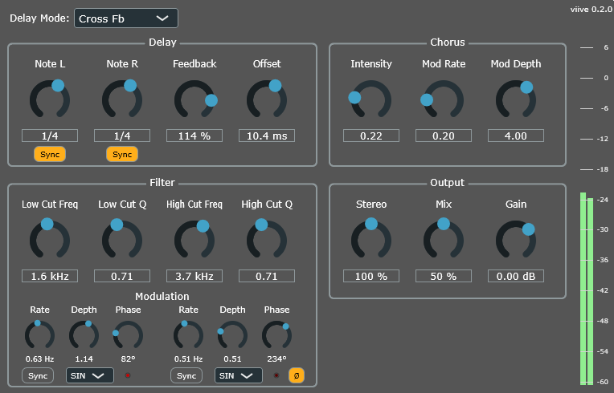

# viive
A VST3 delay plugin built with JUCE. Work in progress.
Personal playground for learning audio DSP and experimenting with feedback-loop effects.
Currently developed and tested on Windows (JUCE AudioPluginHost, Ableton Live Suite 10, Reaper).



## Features
- Functional GUI with parameter controls and output level metering
- Saves and retrieves plugin state
- Separate L/R delay times (5ms - 5000ms) with tempo sync and L/R offset
- Mix and feedback controls with feedback stabilization (0-140%)
- Stereo width control with mid/side processing
- Sculpting low/high-cut filters with adjustable resonance on delayed signal / feedback loop
- Filter modulation section with separate LFOs for high and low cut filters with tempo sync, adjustable rate, modulation depth, stereo phase offset and selectable shapes: Sine, Triangle, Square, Saw Up/Down, Sample & Hold
- Dual-voice chorus effect in feedback loop with intensity, modulation rate, and modulation depth controls
- Feedback loop protection: HPF, compressor, soft clipping

Despite the feedback protection, it can get quite loud and nasty. High feedback settings may produce interesting noise artifacts.

Note: GUI is not final.

See [CHANGELOG.md](./CHANGELOG.md) for version history and detailed changes.

## Download & Installation
Pre-built VST3 binaries for Windows and macOS are available on the [Releases](https://github.com/trsctr/viive/releases) page.

Download the zip for your platform, extract it, and copy `viive.vst3` to your VST3 folder:

- **Windows:** `C:\Program Files\Common Files\VST3\`
- **macOS:** `~/Library/Audio/Plug-Ins/VST3/`

Then rescan plugins in your DAW.

NOTE: macOS build is unsigned and unnotarized. If Gatekeeper blocks the plugin, run the following commands in Terminal after copying it to your VST3 folder:

```bash
xattr -dr com.apple.quarantine ~/Library/Audio/Plug-Ins/VST3/viive.vst3
codesign --force --deep --sign - ~/Library/Audio/Plug-Ins/VST3/viive.vst3
```

Then rescan plugins in your DAW.

## Potential future features
- Additional effects in feedback loop (bitcrush, phaser)
- Preset manager
- Single/dual delay mode switch
- Ducking

## Building
### Requirements
* C++20 compiler (Visual Studio 2022 on Windows, Xcode on macOS)
* CMake 3.22+

### 1) Clone the repository
```bash
git clone https://github.com/trsctr/viive.git
cd viive
```

### 2) Configure and build
```bash
cmake -B Build -DCMAKE_BUILD_TYPE=Release
cmake --build Build --config Release
```

JUCE 8.0.11 is downloaded automatically during configuration.

NOTE: Linux builds are reportedly possible but untested and undocumented.

### Output
The VST3 will be produced under `Build/viive_artefacts/Release/VST3/`.

---
Build setup based on the [JUCE CMake Audio Plugin Template](https://github.com/anthonyalfimov/JUCE-CMake-Plugin-Template).

## Based On
Based on concepts and example code from *The Complete Beginner's Guide to Audio Plug-in Development* by Matthijs Hollemans.